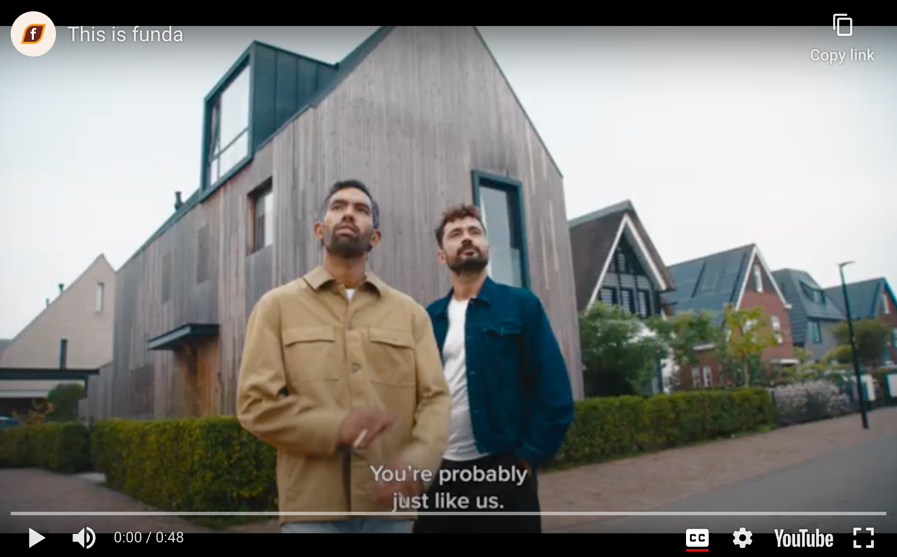

# Design challenge: the funda listing page

## Table of Contents

- [Design challenge: the funda listing page](#design-challenge-the-funda-listing-page)
  - [Table of Contents](#table-of-contents)
  - [About funda](#about-funda)
  - [Requirements](#requirements)
  - [Resources](#resources)
  - [Submitting the project](#submitting-the-project)

## About funda
Funda (derived from "fundum," the Latin word for estate) is a Dutch organization based in Amsterdam that presents Dutch real estate on the internet. The main website of funda is funda.nl. With approximately 68 million visits per month (4 million unique). funda.nl is one of the most heavily visited housing websites in the Netherlands. The website features the entire Dutch housing market for sale, which is offered through real estate agents.

Funda helps individuals during one of the most significant decisions in life: finding or selling a home. It's an exciting and challenging process, so Funda is committed to providing as much support as possible throughout this journey.

In the first semester, you have learned a lot about layout, responsive design, accessibility, interaction and branding. In this 3 week sprint you will apply everything you have learned to rebuild the Media Viewer in the Listing Detail Page (LDP).

 * Go to https://www.funda.nl/koop/heel-nederland/
 * Click on any listing.

This is the Listing Detail Page. Your assignment is to rebuild the mediaviewer from scratch with HTML and CSS. You can use a bit of JavaScript, but it's not a necessity.

There is no need to get the data from any external source, you can just hard-code the data in your HTML.

## Requirements

 * You implement the design according to the Figma file.
 * The page must be responsive using a mobile-first approach. There should be a minimum of 3 breakpoints; mobile, tablet and desktop.
 * To ensure accessibility, use the appropriate semantic HTML tags and accessible attributes for your elements.
 * The elements on this page do not need to be interactive. The goal of this assignment is to build a layout.
 * Do not use any frameworks. Pure HTML and CSS only! While you probably won't need it, you can use javascript if necessary.

## Resources

 * [Figma](https://www.figma.com/design/U8ntWPwQTEKsKKg8IDWKWp/FDND---Media-viewer?node-id=0-1&t=5C3GLSMgZC59gQNg-1).
 * [Assets](https://brand.funda.nl)

## Submitting the project

To submit this project:

 * Fork this repository
 * Create a new pull request (PR) with your project. 
 * You can now request a code review from funda. Be sure to request a review.

If you have any questions, please send an email to larsschuitema@funda.nl

Good luck!
